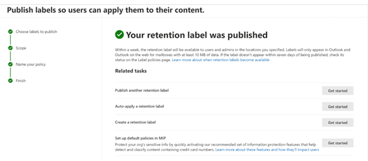

# Manage-Data-Governance-and-Retention
Create a static 10 year deletion retention policy for Teams. Create forever label for MS365 groups.

<h2>Description</h2>
Lab consists of a create and perform an eDiscovery hold for Content Search by using Compliance Purview Portal. Microsoft Purview eDiscovery (Standard) in Microsoft Purview provides a basic eDiscovery tool that organizations can use to search and export content in Microsoft 365 and Office 365.  can also use eDiscovery (Standard) to place an eDiscovery hold on content locations, such as Exchange mailboxes, SharePoint sites, OneDrive accounts, and Microsoft Teams.
<br />


<h2>Environments Used </h2>

- <b>Microsoft Purview Compliance Portal</b> 

<h2>Prerequisites</h2>

-<b> Configuration Profile can be created or modified by anyone assigned the following roles:
 - eDiscovery Manager
 - eDiscovery Administrator
 - Case Management
 - Global Administrator
 </b>
- <b> Licenses: Exchange online Plan 2 or  Microsoft 365 E3 OR Office 365 E3 license or higher OR Office 365 E1 license with a SharePoint Online Plan 2 OR OneDrive for Business Plan 2 add-on license</b>

<h2>Program walk-through:</h2>

<h3>Steps: </h3>

1.  Go to  Microsoft purview portal --> Data lifecycle management --> Microsoft 365
2.	Retention policies --> new retention policy --> give name and choose type of policy
3.	Locations --> select Teams  
4.	Select Retention period ’10 years’
5.	Review finish and Submit
6.	Go to ‘Labels’ tab in Data lifecycle management --> create new --> name it
7.	Define label settings ‘Forever’,  period ‘Forever’ --> Review Finish
8.	Go to Label policies tab --> publish label --> choose a label
9.	Choose scope ‘static’ and choose locations
10.	Name a policy and Finish it

	
<h3>Screenshots:</h3>

<p align="center">
Datalifecycle Management & MS365:  <br/>

<br />
<br />
Create a new Retention policy & Give a Name: <br/>

<br />
<br />
Select a Scope of Retention policy: <br/>

<br />
<br />	
Choose a Location (Teams): <br/>

<br />
<br />
Select Retention Period: <br/>

<br />
<br />
Query Section: <br/>

<br />
<br />
Review & Submit: <br/>

<br />
<br />
Result: <br/>

<br />
<br />
Query Section: <br/>

<br />
<br />
Review & Submit: <br/>

<br />
<br />
Result: <br/>

<br />
<br />

</p>

<!--
 ```diff
- text in red
+ text in green
! text in orange
# text in gray
@@ text in purple (and bold)@@
```
--!>
